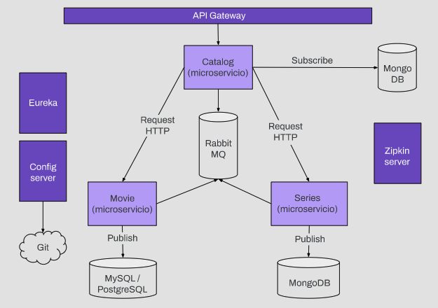
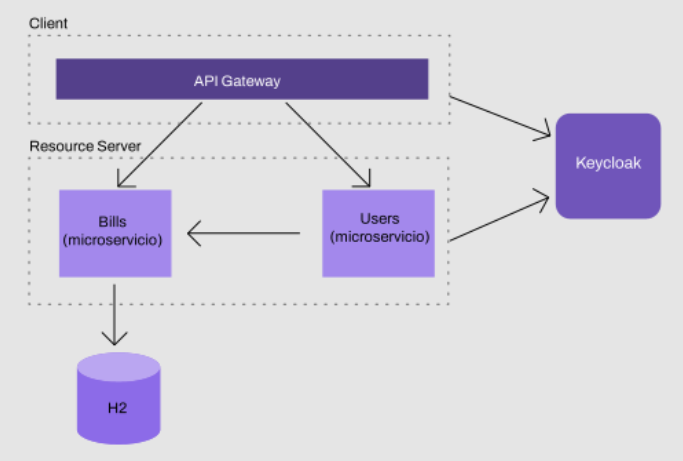

# Backend Especialization

## Microservices Backend

This project consists of three microservices: Movie, Series and Catalog. Catalog is a microservice that reads information from Movie and Series in order to send a catalog to the client. Catalog receives a message each time a movie or series is uploaded and persists them in a non-relational MongoDB database. When a client request arrives, it searches the database and responds. We used eureka for microservices registry, spring gateway for routes to our services and other libraries for tracing, configurations, security, circuit breakers and queues.

### Technologies

* **Eureka Server/Discovery**
* **Spring Cloud Routing - Gateway**
* **Sleuth Zipkin**
* **RabbitMQ**
* **Cloud Config**
* **OAuth2**
* **MongoDB**
* **Resilence4J**

## Keycloak Backend

Backend that is responsible for managing customer invoices, only authenticated users can access the invoices, you must have the USER role to consume the invoices from the endpoint bills/all. Providers can charge and create invoices, and user can find invoices by user ID, users-service need to contact bills-service to get bills, this communication requires Feign and setup users-service like client and reource owner in keycloak. The keycloak configuration, and its correct integration with the different microservices, making use of it to validate the ownership, scope and identity of the users is the essence of this project.

### Technologies

* **Eureka Server/Discovery**
* **Spring Cloud Routing - Gateway**
* **OAuth2**
* **Keycloak**
